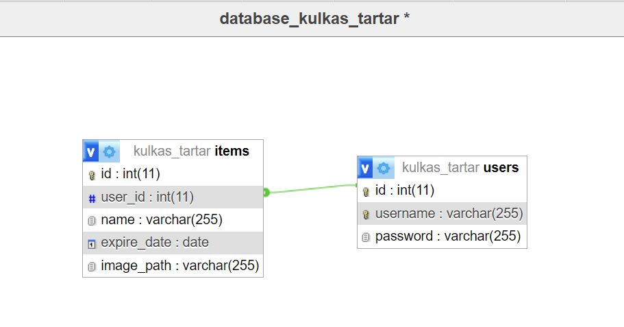
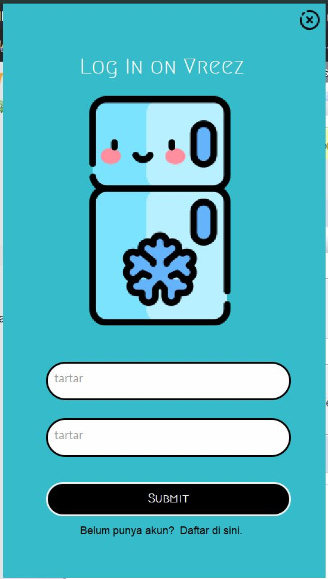
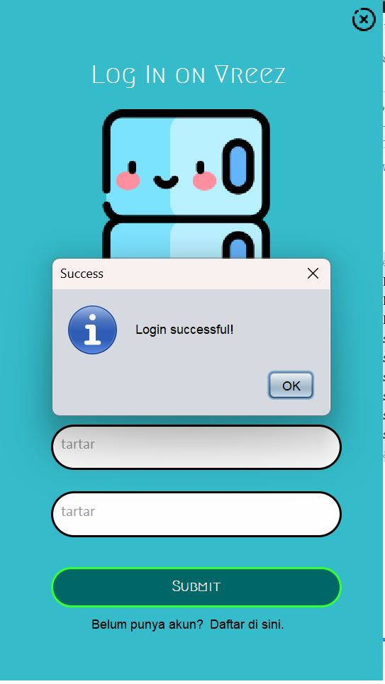
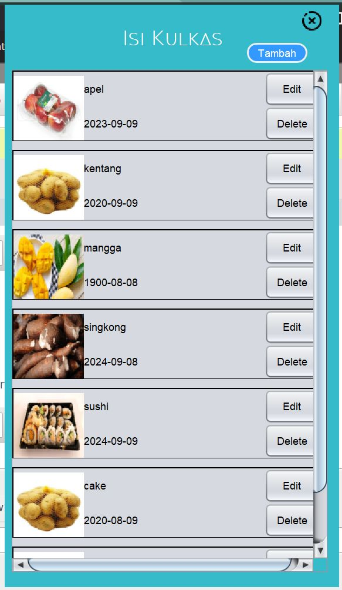
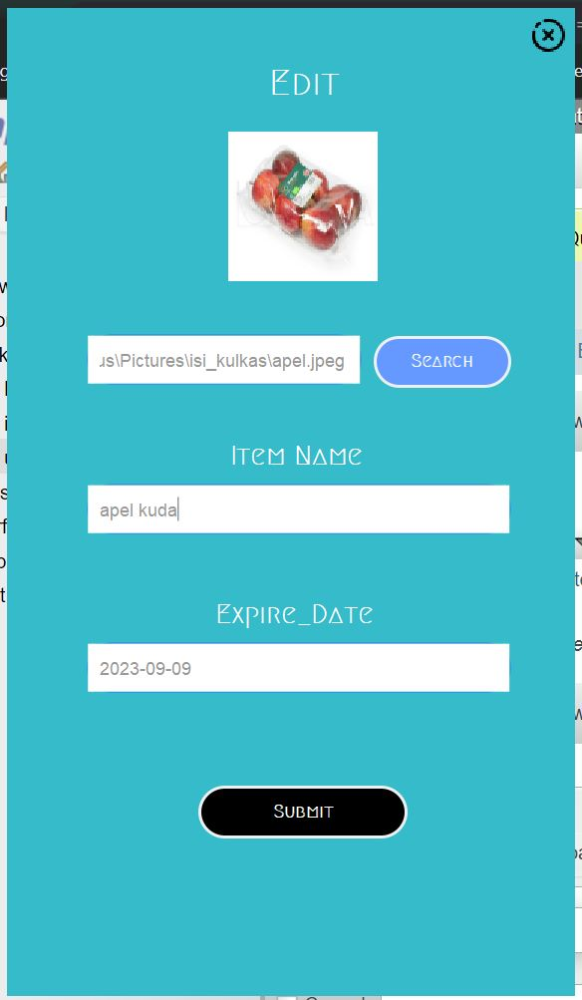
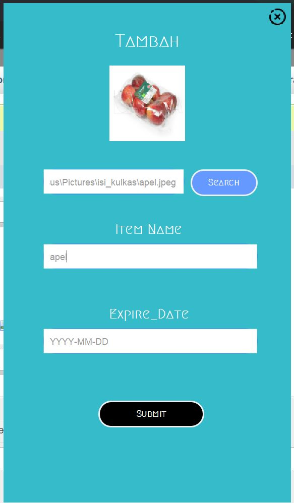
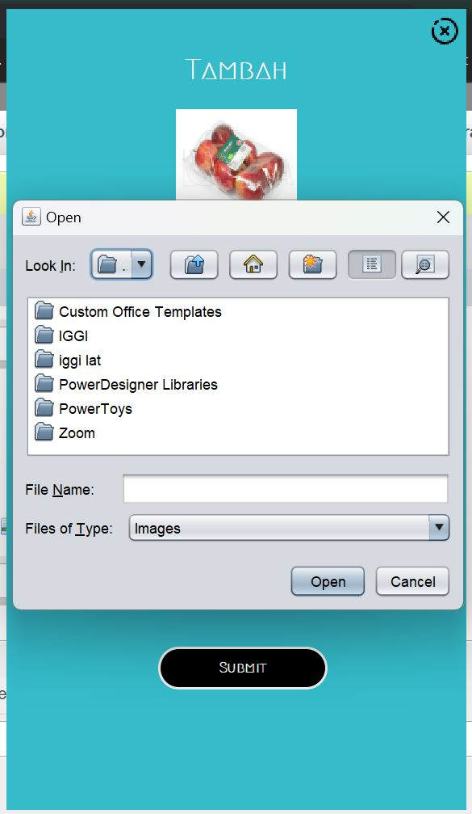

# TP2DPBO2023
TP2 DPBO: Program Java yang terkoneksi dengan database MySQL

-----------------------------------------------------------------------------------------
## Isi Kulkas Tartar
-----------------------------------------------------------------------------------------
## Deskripsi
Program di atas adalah sebuah program yang digunakan untuk mengelola isi kulkas. Program ini dibangun menggunakan bahasa pemrograman Java dan memiliki beberapa fitur, antara lain menambahkan item ke dalam kulkas, mengedit item yang sudah ada, menghapus item, serta melihat item yang ada di dalam kulkas.
## Design Program
Secara desain program ini menggunakan konsep Object Oriented Programming (OOP) dan menerapkan beberapa prinsip SOLID seperti Single Responsibility Principle dan Open/Closed Principle. Hal ini terlihat dari penggunaan beberapa kelas untuk menghandle fungsionalitas tertentu seperti kelas CardItem untuk menampilkan item pada kulkas, kelas Item untuk merepresentasikan suatu item, dan kelas ItemRepository untuk mengelola penyimpanan data item.
### Diagram UML
Diagram UML digunakan untuk merepresentasikan hubungan antar kelas dalam program ini. Diagram UML yang telah dibuat meliputi hubungan inheritance, hubungan composition, dan hubungan association antar kelas dalam program. Dengan diagram UML ini.

- 
#### Detail Kelas
Berikut adalah detail kelas yang digunakan beserta nama filenya:

- CardItem.java: kelas untuk menampilkan item pada kulkas.
- Item.java: kelas untuk merepresentasikan suatu item pada kulkas.
- ItemRepository.java: kelas untuk mengelola penyimpanan data item pada database.
- User.java: kelas untuk merepresentasikan pengguna program.
- dbConnection.java: kelas untuk mengelola koneksi ke database.
- Login.java: kelas untuk menghandle login pengguna program.
- MainPage.java: kelas untuk menampilkan halaman utama program dan menghandle aksi-aksi pengguna.
- EditPage.java: kelas untuk menampilkan halaman edit item dan menghandle aksi-aksi pengguna.
- Tambah.java: kelas untuk menampilkan halaman tambah item dan menghandle aksi-aksi pengguna.
- CustomButton.java: kelas untuk membuat tombol custom pada program.
- CustomField.java: kelas untuk membuat field custom pada program.
### Database Diagram
Database program ini dibangun menggunakan SQLite. Database ini menyimpan data item yang ada di dalam kulkas. Database ini dibangun menggunakan ORM (Object-Relational Mapping) dengan memanfaatkan fitur SQLite JDBC untuk memudahkan pengaksesan data. 

- 

Program ini menggunakan dua tabel dalam database, yaitu "items" dan "users". Berikut adalah penjelasan fungsi dari masing-masing tabel:

1. Tabel "items"
Tabel "items" berfungsi sebagai tabel penyimpanan data mengenai barang-barang yang tersimpan dalam kulkas. Setiap record dalam tabel ini merepresentasikan satu barang, dan berisi informasi seperti nama barang, jumlah, tanggal kadaluarsa, dan id user yang memiliki barang tersebut. Tabel "items" terhubung dengan tabel "users" melalui foreign key "user_id" yang mereferensikan ke primary key "id" di tabel "users".

2. Tabel "users"
Tabel "users" berfungsi sebagai tabel penyimpanan data mengenai pengguna program ini. Setiap record dalam tabel ini merepresentasikan satu pengguna, dan berisi informasi seperti nama pengguna, email, dan password. Tabel "users" juga memiliki primary key "id" yang digunakan sebagai foreign key di tabel "items" untuk mengetahui id pengguna yang memiliki barang tertentu.

## Alur Kerja Program
Program ini memiliki alur kerja yang sederhana. Pertama-tama, pengguna harus login menggunakan akun yang sudah terdaftar di dalam program. Setelah login, pengguna akan dibawa ke halaman utama yang menampilkan item-item yang sudah ada di dalam kulkas. Dari halaman utama, pengguna dapat menambahkan, mengedit, atau menghapus item pada kulkas.

## Batasan Program
- File `jar` yang dijalankan harus yang di dalam folder `isikulkas_tartar`, selain itu gambar tidak akan terload.
- Program hanya dapat dijalankan pada komputer dengan sistem operasi Windows.
- Program memerlukan koneksi internet untuk melakukan proses login dan menyimpan data ke database.
  - port MYSQL yang digunakan saat pembuatan adalah `3306`
- Program hanya dapat digunakan oleh satu pengguna pada satu waktu. Karena hanya ada fitur `login`
  - Akses akun:
    - username: tartar
    - password: tartar
- User belum bisa mengupload gambar dari direktori selain dalam `package gambar` dalam folder proyek ini.
  - jika ingin mengupload gambar lain, harus dimasukkan terlebih dahulu ke dalam folder `src/gambar`
  - format gambar hanya menerima `.jpg`
- Program dapat `didrag` ke berbagai posisi
  - program hanya menyediakan tombol `exit`, untuk minimize dan yang lainnya belum ada
  
## Screenshots Program
- Login

- Halaman Utama

- Halaman edit

- Halaman Tambah

## Cara Menjalankan Program
Untuk menggunakan dan menjalankan program, ikuti langkah-langkah berikut:

1. Download satu project isikulkas_tartar
2. Buka file jar program di folder `isikulkas_tartar` (*bukan* yang di dalam folder dist ataupun folder JAR)
4. Pastikan terhubung ke `Localhost`, di sini digunakan MySQL port `3306`
3. Jalankan file jar program dengan cara double click pada file atau jalankan melalui command prompt dengan perintah "java -jar [isikulkas_tartar].jar".
4. Program akan terbuka dan pengguna dapat melakukan login dengan akun yang telah terdaftar.
  - Akses akun:
    - username: tartar
    - password: tartar
